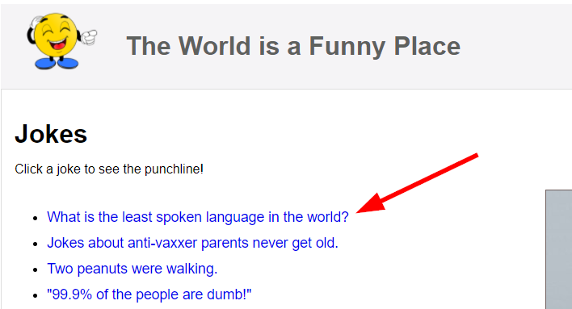
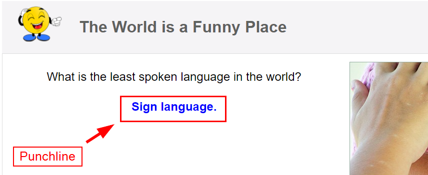
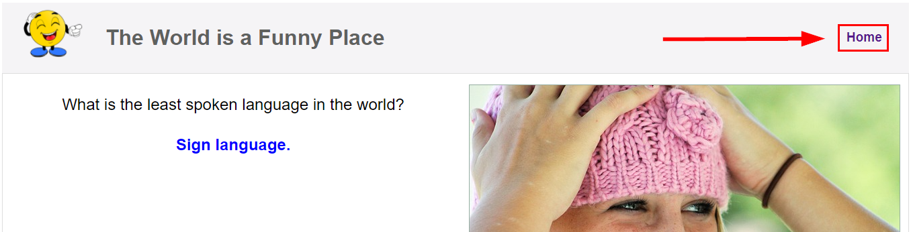

# HyperionDev Full Stack Web Development Bootcamp - Level 3 - Task 11 - Next.js app - Jokes

## Description

This app uses Next.js to serve up a few jokes from a simple jokes api. It fetches new jokes each time it is loaded. When you click on a joke, it takes you to another page which reveals the punchline.

This project has been deployed with [Vercel](https://vercel.com/) to: [https://jokesonyou-six.vercel.app/](https://jokesonyou-six.vercel.app/).

## Table of Contents

- [Instructions](#instructions)
- [Technologies](#technologies)
- [Installation](#installation)
- [Usage](#usage)
- [Credits](#credits)

## Instructions

These were the instructions I was given to guide me in this task:

**Follow these steps:**

- Create a new project using Next.js. This should be a dynamic website that is created using data retrieved from an API. You can use a simple API of your choice. Here are a few suggestions:
  - Musixmatch API
  - The Star Wars API
  - Spotify API

The web app should contain at least two pages: an index page and a page that displays details about the topic that the user selects on the index page. For example, if you create your app using the Star Wars API you could
display all the films (e.g. https://swapi.dev/api/films) on the index page and all the details about the specific film selected by the user on the details page (e.g. https://swapi.dev/api/films/1).

- Be sure that your website is attractively styled and that you share a layout component.

### Technologies

This project uses:

- HTML
- Styled JSX
- Javascript
- Next.js
- Node
- React
- Express

## Installation

To run this project, do the following:

1. Copy the project files to a directory called 'jokes' on your local machine.
2. Navigate to this directory from the command line interface. E.g. cd c:/jokes.
3. In the command line interface type 'npm install'.
4. Once it has finished installing, type 'npm run dev'.
5. Open [http://localhost:3000](http://localhost:3000) to view the project in your web browser.

## Usage

1. Once you open the project in your browser [http://localhost:3000](http://localhost:3000), you will see a list of 5 jokes (these are the first part of a two part joke). See figure 1 below.

Figure 1

2. Click on any of the jokes to be taken to another page, where the punchline of the joke will be revealed. See figure 2 below.

Figure 2

3. Click the "Home" link at the top right corner of the page to return to the home page, where you can select a different joke. See figure 3 below.

Figure 3

## Credits

This project was created by Evan Malherbe as part of a task for HyperionDev Full Stack Development Bootcamp - December 2021 [GitHub profile](https://github.com/evanmalherbe)
